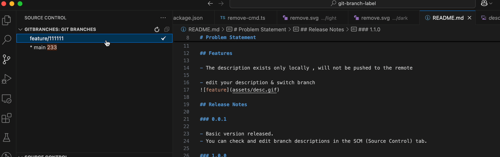

# git-branch-description README

[简体中文](readme/README.zh_CN.md) 

Give your git branch a user-friendly description!

# Problem Statement
- In large projects with frequent iterations, developers often name their local development branches using specific rules, such as dates or task numbers. Over time, it can become challenging to remember the purpose of each branch, especially when naming conventions are not uniformly followed. This plugin allows developers to add meaningful descriptions to their branches, making it easier to understand their purpose at a glance.
- When your peers name their branches with terrible names.

## Features

- The description exists only locally , will not be pushed to the remote 

- edit your description & switch branch

## Release Notes

### 0.0.1

- Basic version released.
- You can check and edit branch descriptions in the SCM (Source Control) tab.

### 1.0.0

- now,you can switch branch use switch button
- you can check this extensions in gitBranches tab

# How to Use

1. Install the plugin [git branch description] in vscode 
2. Now, a new tab named gitBranches will appear on the left side of the editor
3. enjoy!

**Enjoy!**
